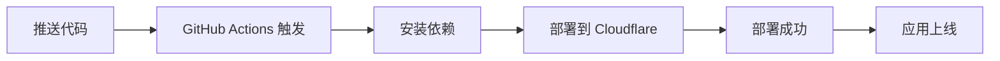

# 🎯 自动部署配置指南

欢迎！本指南将帮助您在 5 分钟内完成 Cloudflare 自动部署配置。

---

## 📋 配置检查清单

在开始之前，请确保：

- [ ] 有 Cloudflare 账号（[免费注册](https://dash.cloudflare.com/sign-up)）
- [ ] 有 GitHub 账号
- [ ] 已 fork 或 clone 本仓库
- [ ] 本地安装了 Node.js (v16+)

---

## 🚀 配置步骤

### 方式 A: 使用自动化脚本（最简单）

只需一条命令：

```bash
./setup-auto-deploy.sh
```

脚本会引导您完成所有配置。

### 方式 B: GitHub Actions（推荐用于团队）

#### 步骤 1: 获取 Cloudflare API Token


1. 登录 https://dash.cloudflare.com
2. 点击右上角头像 → **My Profile**
3. 左侧菜单 → **API Tokens**
4. 点击 **Create Token**
5. 选择 **Edit Cloudflare Workers** 模板
6. 点击 **Continue to summary** → **Create Token**
7. **复制 Token**（只显示一次）

#### 步骤 2: 获取 Account ID


1. 在 Cloudflare Dashboard 首页
2. 右侧栏找到 **Account ID**
3. 点击复制按钮

#### 步骤 3: 配置 GitHub Secrets


1. 打开仓库：https://github.com/phaip88/cursor
2. **Settings** → **Secrets and variables** → **Actions**
3. 点击 **New repository secret**

添加以下 Secrets：

| Name | Value | 说明 |
|------|-------|------|
| `CLOUDFLARE_API_TOKEN` | `your_api_token` | 第 1 步获取的 Token |
| `CLOUDFLARE_ACCOUNT_ID` | `your_account_id` | 第 2 步获取的 ID |

#### 步骤 4: 创建 KV 命名空间


在项目目录运行：

```bash
npx wrangler login
npx wrangler kv:namespace create "CONFIG_KV"
npx wrangler kv:namespace create "CONFIG_KV" --preview
```

复制输出的 ID，更新到 `wrangler.toml`：

```toml
[[kv_namespaces]]
binding = "CONFIG_KV"
id = "复制的生产环境ID"
preview_id = "复制的预览环境ID"
```

#### 步骤 5: 触发自动部署


```bash
git add wrangler.toml
git commit -m "配置 KV 命名空间"
git push origin main
```

✅ 完成！GitHub Actions 会自动部署。

---

## 📊 部署状态监控

### 查看 GitHub Actions

1. 仓库页面 → **Actions** 标签
2. 查看最新的工作流运行
3. 点击查看详细日志

### 部署成功标志

```
✅ 部署成功！
访问您的应用: https://email-sender.YOUR_SUBDOMAIN.workers.dev
```

---

## 🔄 工作流程



文字版：
```
代码推送 → Actions 触发 → 安装依赖 → 部署 → 上线
```

---

## 🎯 触发条件

| 操作 | 是否部署 | 说明 |
|------|----------|------|
| 推送到 main | ✅ | 自动部署到生产环境 |
| 推送到 develop | ✅ | 可配置为测试环境 |
| 创建 PR | ✅ | 运行测试（不部署） |
| 手动触发 | ✅ | Actions 页面手动运行 |

---

## 🛠️ 高级配置

### 多环境部署

编辑 `.github/workflows/deploy.yml`，添加环境配置：

```yaml
jobs:
  deploy-staging:
    if: github.ref == 'refs/heads/develop'
    # 部署到测试环境
    
  deploy-production:
    if: github.ref == 'refs/heads/main'
    # 部署到生产环境
```

### 部署通知

添加 Slack、Discord 或邮件通知：

```yaml
- name: 部署通知
  uses: 8398a7/action-slack@v3
  with:
    status: ${{ job.status }}
    webhook_url: ${{ secrets.SLACK_WEBHOOK }}
```

---

## 🐛 常见问题

### Q1: Actions 失败 - Authentication error

**原因**: API Token 无效或过期

**解决**:
1. 重新生成 Token
2. 更新 GitHub Secret `CLOUDFLARE_API_TOKEN`

### Q2: KV namespace not found

**原因**: KV 未创建或 ID 配置错误

**解决**:
```bash
wrangler kv:namespace list
# 检查 wrangler.toml 中的 ID 是否匹配
```

### Q3: 部署成功但无法访问

**原因**: DNS 传播中

**解决**: 等待 1-5 分钟，DNS 全球生效

---

## 📞 获取帮助

遇到问题？

1. 📖 查看 [详细文档](../CLOUDFLARE_DEPLOY.md)
2. 🔍 搜索 [Issues](https://github.com/phaip88/cursor/issues)
3. 💬 提交新 [Issue](https://github.com/phaip88/cursor/issues/new)

---

## ✅ 配置完成后

恭喜！现在您可以：

- ✅ 推送代码自动部署
- ✅ 查看部署历史和日志
- ✅ 回滚到之前的版本
- ✅ 享受 CI/CD 的便利

**下一步**: 访问应用并配置 Resend API Key

---

**🎉 享受自动部署的便利吧！**
